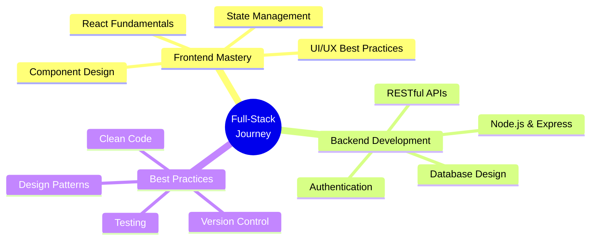

<div align="center">
  
# 👋 Hi, I'm Aman

### Computer Science Student | Full-Stack Developer in Progress

[](https://git.io/typing-svg)

<p align="center">
  
  
</p>

</div>

---

## 👨‍💻 About Me

```javascript
const aman = {
    pronouns: "He/Him",
    location: "India 🇮🇳",
    education: "Computer Science Student",
    currentFocus: "Full-Stack Development",
    learning: ["React", "Node.js", "MongoDB", "System Design"],
    interests: ["Web Development", "UI/UX", "Problem Solving"],
    philosophy: "Learning by building real projects and fixing real mistakes",
    funFact: "My GitHub is not a showcase of perfection — it's a record of growth 🌱"
};
```

I'm a passionate Computer Science student who believes in **learning by doing**. Most of my work is frontend and JavaScript-driven, but I'm actively expanding into full-stack development. Every repository here represents a step forward in my journey from beginner to professional developer.

---

## 🛠️ Tech Stack

<div align="center">

### Languages


### Frontend Development


### Backend Development (Learning)


### Tools & Technologies


</div>

---

## 📊 GitHub Statistics

<div align="center">
  
  
</div>

<div align="center">
  
</div>

<div align="center">
  
</div>

---

## 🏆 GitHub Trophies

<div align="center">
  
</div>

---

## 📌 What You'll Find Here

<table align="center">
<tr>
<td align="center" width="33%">

<br />
<strong>Learning Projects</strong>
<br />
<sub>UI experiments, small apps, and coding challenges</sub>
</td>
<td align="center" width="33%">

<br />
<strong>Frontend Clones</strong>
<br />
<sub>Interface recreations and responsive designs</sub>
</td>
<td align="center" width="33%">

<br />
<strong>Full-Stack Apps</strong>
<br />
<sub>SpendWise/Xpense and other MERN projects</sub>
</td>
</tr>
</table>

---

## 🌱 Currently Focusing On

<div align="center">



</div>

- 🎯 **JavaScript Deep Dive**: Advanced concepts, async patterns, and clean architecture
- ⚛️ **React Ecosystem**: Hooks, Context API, React Router, and component patterns
- 🔧 **Backend APIs**: Building robust REST APIs with Node.js and Express
- 🗄️ **Database Design**: MongoDB schema design and optimization
- 🎨 **UI/UX**: Writing maintainable, accessible, and responsive interfaces
- 📚 **System Design**: Understanding how frontend, backend, and data connect

---

## 🎯 My Goals

<div align="center">

| Short Term | Long Term |
|------------|-----------|
| ✅ Build 3+ full-stack projects | 🎯 Become a proficient Full-Stack Developer |
| ✅ Master React fundamentals | 🎯 Contribute to open-source projects |
| 🔄 Complete Node.js & Express mastery | 🎯 Build scalable production applications |
| 🔄 Master MongoDB deeply | 🎯 Share knowledge through blogs/tutorials |
| 📝 Practice DSA regularly | 🎯 Land a software engineering role |

</div>

---

## 📫 Connect With Me

<div align="center">

[](https://linkedin.com/in/yourprofile)
[](https://twitter.com/yourhandle)
[](https://yourportfolio.com)
[](mailto:your.email@example.com)

</div>

---

## 💭 Quote of the Day

<div align="center">


</div>

---

<div align="center">
  
### 💡 *"My GitHub reflects my journey — not just the final destination."*

**Thanks for visiting! Feel free to explore my repositories and connect with me.** 🚀


</div>
